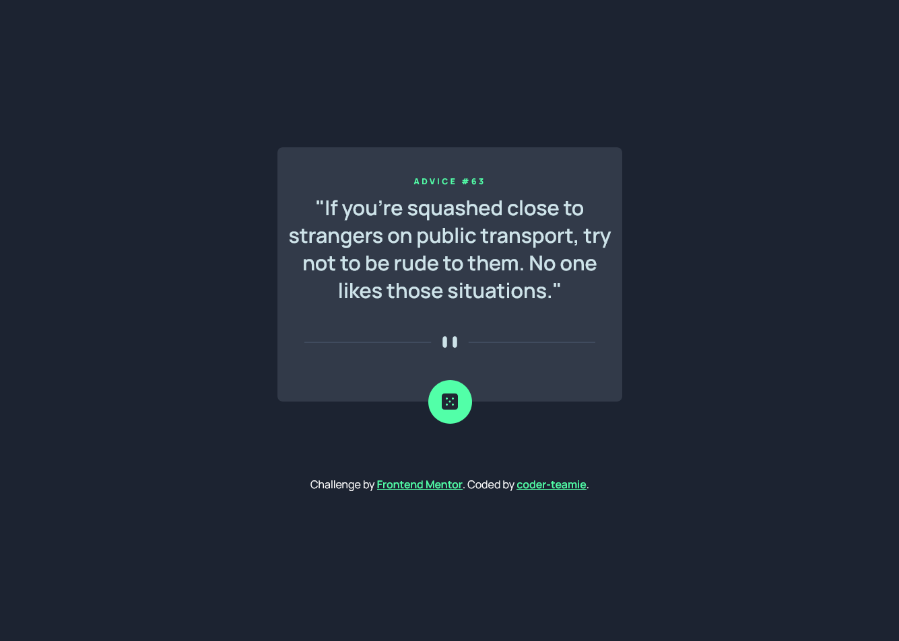
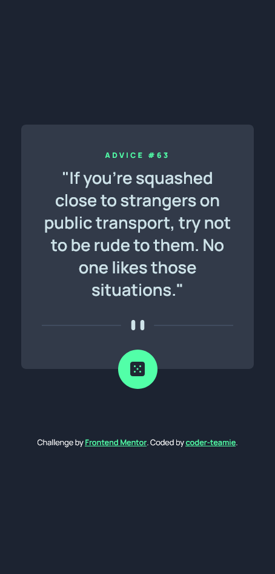

# Frontend Mentor - Advice generator app solution

This is a solution to the [Advice generator app challenge on Frontend Mentor](https://www.frontendmentor.io/challenges/advice-generator-app-QdUG-13db). Frontend Mentor challenges help you improve your coding skills by building realistic projects.

## Table of contents

- [Overview](#overview)
  - [The challenge](#the-challenge)
  - [Screenshot](#screenshot)
  - [Links](#links)
- [My process](#my-process)
  - [Built with](#built-with)
  - [What I learned](#what-i-learned)
  - [Useful resources](#useful-resources)
- [Author](#author)

## Overview

This app aims to display randomly generated advice with a corresponding slip_ID from an API and will be continouosly fetching random advice once the button is clicked or once the page is loaded/reloded.

### The challenge

Users should be able to:

- View different advice quotes once they click on the dice button and also once they load or reload the page.

### Screenshot




### Links

- Solution URL: [Frontend Mentor](https://your-solution-url.com)
- Live Site URL: [Netlify](https://coder-teamie-advice-generator-app.netlify.app/)

## My process

I started this challenge developing the interface and designed both the mobile and desktop layouts using SCSS. I later proceeded in into developing the javascript codes required to fetch the random advice from the API. I started by making the fetch request to be accomplished once the content of the DOM is loaded to have a random value and then proceeded in making another fetch request to the API once the dice button is clicked.

### Built with

- Semantic HTML5 markup
- CSS custom properties
- CSS Grid
- Mobile-first workflow
- JavaScript

### What I learned

Engaging in this challenge helped me learn how to embedd images in a button and I was able practice using different approaches in Javascript to get the required output.

## Some code snippets:

Using this code snippet to fetch a random advice using a random slip_id from the API

```js
window.addEventListener('DOMContentLoaded', async function () {
  const randomID = Math.ceil(Math.random() * 100);
  const randomURL = 'https://api.adviceslip.com/advice/';
  try {
    const response = await fetch(`${randomURL}${randomID}`);
    const data = await response.json();
    displayAdvice(data);
  } catch (error) {
    console.log(error);
  }
});
```

```js
// Display Advice in DOM
function displayAdvice(data) {
  const { id: adviceId, advice } = data.slip;
  content.innerHTML = `<p>"${advice}"</p>`;
  id.innerHTML = adviceId;
  setTimeout(function () {
    btn.classList.remove('animate');
  }, 3000);
}

// ****** /getElement.js ******
const get = (selection) => {
  const element = document.querySelector(selection);
  if (element) return element;
  throw new Error(
    `Please check "${selection}" selector, no such element exist`
  );
};

export default get;
```

### Useful resources

- [DelftStack](https://www.delftstack.com/howto/html/html-button-with-image/) - This resource taught me how to embed an image in the HTML button
- [Advice Slip JSON API](https://api.adviceslip.com/advice) - API for the challenge

## Author

- Instagram - [Oluwatimilehin](https://www.instagram.com/tea__scripts/)
- Frontend Mentor - [@coder-teamie](https://www.frontendmentor.io/profile/coder-teamie)
- Twitter - [@teamie\_\_](https://twitter.com/tea__scripts)
